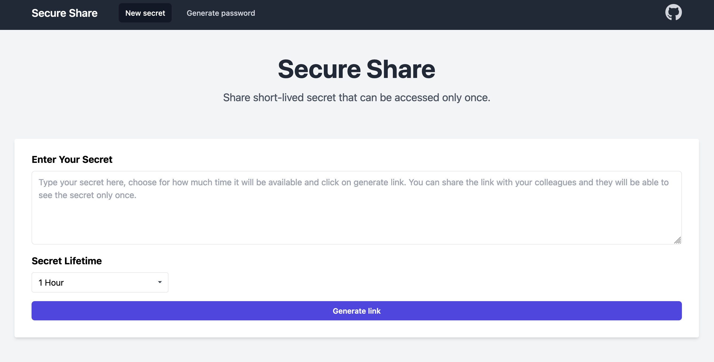

[](https://goreportcard.com/report/github.com/lorenzophys/secure-share)


# Secure Share

**Secure Share** is a One-Time Password (OTP) service: a lean, efficient solution, similar in concept to Snappass but optimized for ease of use and low resource consumption, with a total size of only 16MB. Designed to work out-of-the-box, it requires no initial configuration, making it ideal for quick deployments and hassle-free setup.



## Features

- Lean and Efficient with a minimal footprint.
- No initial configuration required. Start using it immediately after deployment.
- Flexible Storage Options:
  - Redis Store: Secure Share offers integration with a Redis backend.
  - In-Memory Store: for quick testing or simpler use cases, an in-memory store is available, requiring no external     dependencies.
- Robust Encryption: Utilizes the Fernet encryption algorithm. The Fernet key is derived a UUID with `pbkdf2`, ensuring that the secret and the key are never stored together.
- Ephemeral Secrets: Combines the TTL feature of the Fernet algorithm with the TTL of the store, guaranteeing that secrets are truly ephemeral.

## Notes on encryption

Following the [reccomendetions from OWASP](https://cheatsheetseries.owasp.org/cheatsheets/Password_Storage_Cheat_Sheet.html#pbkdf2) the Fernet key is derived from a UUID, salted with a random sequence and passed to `pbkdf2` using `600000` iterations.

## Quickstart

Running the service is as straightforward as executing the following command in the root of the repository:

```shell
docker compose up -d --build
```

then you can test the UI by connecting to `localhost:8080`.

## Configuration

Here are all the environment variables that can be used:

| Variable      | Description | Default Value | Notes |
|---------------|-------------|---------------|-------|
| `REDIS_ADDR` | The address for the Redis server (if using Redis store). | `redis:6379` | Used when connecting to a Redis instance. |
| `REDIS_DB` | The name of the Redis database to use (if using Redis store). | `"0"` | As a string. |
| `REDIS_DPASSWORD` | The password of the Redis instance. | `""` | For the K8s deployment see the Helm chart example. |
| `BASE_URL` | The base URL of the service. | `localhost:8080` | Useful for constructing URLs in responses. |
| `STORE_BACKEND` | Type of storage backend to use (`redis` or `in-memory`). | `in-memory` | Choose `redis` for persistence, `in-memory` for simplicity. The `in-memory` store will reset if the container is restareted. |
| `DEBUG_MODE` | Toggles debug mode for additional logging. | `false` | Set to `true` for verbose logging during development or troubleshooting. |
| `TITLE` | The title visible at the top of the page. | `"Secure Share"` | Can be the name of the company. |
| `SUBTITLE` | The subtitle visible at the top of the page. | `"Share short-lived secret that can be accessed only once."` | Can be the company tagline. |
| `TLS_ENABLED` | Toggles TLS. | `false` | Set to `true` enables TLS. |
| `CERT_FILE` | The path of the TLS certificate. | `""` |  |
| `KEY_FILE` | The path of the TLS key. | `""` |  |

## Helm chart

Secure Share comes with a Helm chart for Kubernetes deployment.
To install the chart first add the repo:

```shell
helm repo add secure-share https://lorenzophys.github.io/secure-share
```

then you can install Secure Share by running:

```shell
helm install <release-name> secure-share/secure-share
```

Here some configuration examples.

### In-memory store for development purposes

```yaml
# ...

ingress:
  enabled: false

config:
  env:
    STORE_BACKEND: "in-memory"
    DEBUG_MODE: "true"

redis:
  enabled: false
```

### In-memory store with Nginx ingress

```yaml
# ...

ingress:
  enabled: true
  annotations:
    kubernetes.io/ingress.class: "nginx"
  hosts:
    - host: secure-share.yourcompany.com
      paths: ["/"]

config:
  env:
    BASE_URL: "secure-share.yourcompany.com"
    STORE_BACKEND: "in-memory"

redis:
  enabled: false
```

### Redis store with Nginx ingress

```yaml
# ...

ingress:
  enabled: true
  annotations:
    kubernetes.io/ingress.class: "nginx"
  hosts:
    - host: secure-share.yourcompany.com
      paths: ["/"]

config:
  env:
    REDIS_ADDR: "secure-share-redis-master.default.svc.cluster.local:6379"
    BASE_URL: "secure-share.yourcompany.com"
    STORE_BACKEND: "redis"
  redisAuth:
    secretName: "secure-share-redis"
    secretKey: "redis-password"

redis:
  enabled: true
  auth:
    password: "secretpassword" # Don't do this
```

## License

This project is licensed under the MIT License - see the LICENSE file for details.
